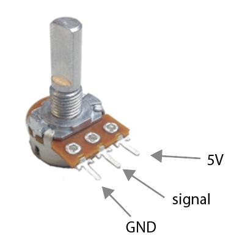
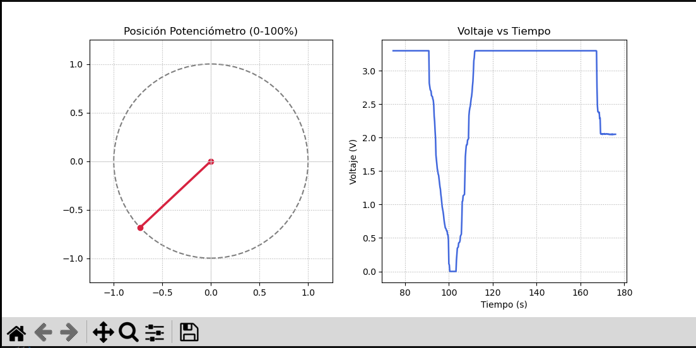

# Potenciometro con micro-ROS (ESP32)

TP Integrador — FULGOR ROS2-IA

Firmware para ESP32 que usa uno de los conversores 
analogicos-digitales (ADC) del micro para leer la señal
de salida de un potenciometro y publica la posición (0 a 100%) 
y el voltaje (0 a 3.3v) como tópicos de **ROS2**, vía **micro-ROS**.


## Objetivos

- Configurar el módulo PCNT del ESP32 para leer las señales de un encoder de cuadratura en modo 4x.
- Implementar un nodo en el ESP32 usando micro-ROS que publique posición y voltaje.
- Visualizar y validar los datos del del potenciometro.

## Hardware

- ESP32 DevKit (30 pines).
- Potenciometro (50K).
- Red WiFi compartida entre el ESP32 y la PC que corre el Agent.

### Conexión

| POTENCIOMETRO | ESP32 |
|---|---|
| SALIDA | GPIO35 |
| GND | GND |
| +   | 3V3 |




## Estructura del proyecto

```
potenciometro/
├── main/
│   ├── potenciometro_microros_main.c   # firmware: nodo micro-ROS
│   └── CMakeLists.txt
├── components/
│   └── micro_ros_espidf_component/   # componente micro-ROS 
├── pc_tools/
│   └── potenciometro_monitor.py        # monitor de PC: posición, curva y log CSV
└── docs/img/                     # capturas y fotos del armado
```

## Tópicos publicados

| Tópico | Tipo | Descripción |
|---|---|---|
| `/posicion` | `std_msgs/Int32` | Posición del potenciometro |
| `/votaje` | `std_msgs/Float32` | Voltaje de salida del potenciometro |


## Cómo compilar y flashear

```bash
mkdir components
cd components
git clone -b jazzy https://github.com/micro-ROS/micro_ros_espidf_component.git
```


```bash
cd potenciometro
. $IDF_PATH/export.sh
idf.py menuconfig   # micro-ROS Settings: Agent IP/Port, WiFi SSID/Password
idf.py build
idf.py flash monitor
```


## Cómo levantar el micro-ROS Agent

En otra terminal (esta sí con ROS2 sourceado):

```bash
cd ~/micro_ws
source install/setup.bash
ros2 run micro_ros_agent micro_ros_agent udp4 --port 8888
```

Verificación:
```bash
ros2 topic list
ros2 topic echo /posicion
ros2 topic echo /voltaje
```

## Visualización y log de datos


```bash
cd pc_tools
python3 potenciometro_monitor.py
```



